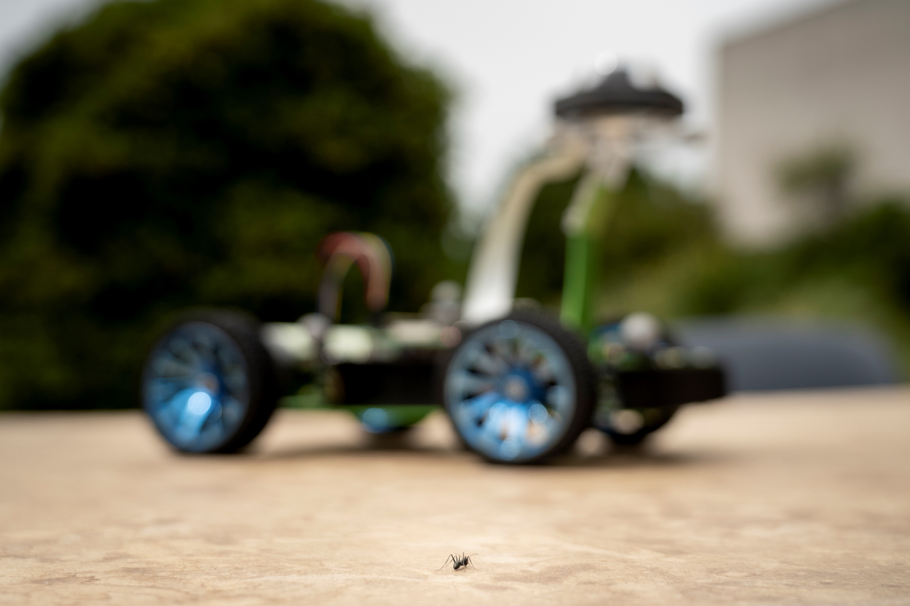

# Continuous Visual Navigation with Ant Inspired Memories

Code (and dataset) for our submitted paper "Continuous Visual Navigation with Ant Inspired Memories" in *Nature Communications*.

You can download the paper via: **Upon Publication** 

<!-- [[DOI]](https://doi.org/xx/xx) [[ResearchSquare]](https://arxiv.org/abs/xxxx.xxxxx). -->

The explicative video is available at [[YouTube]](https://youtu.be/CCDl1MpmEcc)

## One-Sentence Summary

Our work presents an ant-inspired Mushroom Body model on a compact, low-cost robotic platform, achieving continuous, efficient, and adaptable navigation in real-world environments with minimal computational resources.




## Abstract

Solitary foraging ants excel in following long visual routes in complex environments with limited sensory and neural resources—an ability that remains challenging for robots with minimal computational power. Here, we introduce a self-supervised, insect-inspired neural network that enables robust route-following on the compact, low-cost Antcar robot. The robot leverages key aspects of ant brain and behavior: (i) continuous, one-shot visual route learning using panoramic encoding in a mushroom body-inspired network, (ii) categorization of low-resolution egocentric panoramas via oscillatory movements, (iii) opponent-process control of angular and forward velocities based on visual familiarity, (iv) recognition of places of interest along routes, and (v) motivation-based memory modulation. Antcar autonomously followed routes between indoor or outdoor destinations, forward or backward, while remaining stable in both theoretical analysis and real-world testing despite occlusions and visual changes. Across 1.3 km of autonomous travel, Antcar achieved challenging route-following with sub-20 cm lateral error at speeds up to 150 cm/s, requiring only 148 kilobits of memory and processing panoramas every 62 ms. This efficient, brain-inspired architecture stands out from more sensor-intensive and computationally demanding methods, presenting a neuromorphic approach with valuable insights into insect navigation and practical robotic applications.

## Project Setup and Environment Preparation

### Clone

```bash
git clone "**Upon Publication**"
```

### Create an anaconda environment [Optional]:

```bash
conda create -n ContinuousVis
conda activate ContinuousVis
pip install -r docs/requirements.txt
```

## Python Dependencies

- numpy==1.24.4
- opencv-python==4.6.0
- pandas==1.5.3
- scikit-image==0.21.0
- matplotlib==3.7.2
- plotly==5.19.0
- seaborn==0.13.0
- scipy==1.10.1
- tilemapbase==0.4.7
- scikit-learn==1.3.1 

### Prepare the training data:

- Download the dataset files [here](https://figshare.com/s/e4428b192d10275df1a0).
- Extract them to the `data` folder.
- The directory structure will be as follows:
```
my_project/
├── data/                         # Entire data folder (ignored by Git, downloadable from link)
│   ├── raw/                      # Raw experimental data
│   │   ├── image_offline/        # Images from offline acquisition (e.g., database creation)
│   └── processed/                # Processed or analyzed data, if any
├── src/                          # For main source code (e.g., Python scripts, modules)
├── notebooks/                    # For Jupyter notebooks for analysis and figure generation
├── figures/                      # For generated figures and visualizations
├── docs/                         # For documentation, README, and reference files
└── .gitignore                    # Specifies which files and directories to ignore

```

## Running Offline Experiments with Lateralized MBONs

### Running the Python Script with the Pipeline

This project includes a Bash pipeline script, `pipeline.sh`, that sets up and runs the Python training and testing script (`train_test_mapping.py`) with specified parameters. Here’s how to use it.

#### Prerequisites

1. **Python Packages**: Ensure all required Python packages are installed by running:
   ```bash
   pip install -r requirements.txt
   ```
2. **Data Preparation**: Ensure your input data is located at the paths specified in `pipeline.sh`, or modify the paths in the script as needed.

#### Running the Pipeline

The `pipeline.sh` script automates parameter logging and executes `train_test_mapping.py` with specified values for each experiment.

1. Make sure `pipeline.sh` is executable. If not, grant execution permissions:
   ```bash
   chmod +x pipeline.sh
   ```

2. Run the pipeline with:
   ```bash
   ./pipeline.sh
   ```

This script does the following:
- Logs each set of parameters in `mapping_parameters.csv`.
- Generates a unique identifier for each experiment.
- Saves the processed data to a uniquely named output file for each configuration in `../data/processed/`.

#### Customizing Parameters in `pipeline.sh`

In `pipeline.sh`, you can modify the following parameters to customize each experiment:

- **Input paths**:
  - `irl_path`: Path to the learning route.
  - `it_path`: Path to the all image dataset to be tested.
  
- **Parameter Values**:
  - `param_values`: Comma-separated list of parameters used by `train_test_mapping.py`, the paramaters for each MBONs.
  - `b`: A constant value, the steps between images rotation in the learning phase.

- **Visualization Values**:
  - `vis_values`: Comma-separated values specifying vision processing parameters such as numbers of pixels and gaussian sigma value.

- **Save Option**:
  - `sav`: A flag to control saving options (0 or 1), to save or not the image processed during experiments.

- **OSL Values List**:
  - `osl_values_list`: A list of amplitude for learning oscillation value to iterate over, defining different values of `osl` for each run.

For example, to adjust the parameters for different input data or configurations, edit these variables directly in `pipeline.sh`:
```bash
irl_path="../data/raw/images_offline/images_100523_AVM_line_mapping/Expl4"
it_path="../data/raw/images_offline/images_100523_AVM_line_mapping/all"
param_values="10000,4,5,0.01,10000,4,5,0.01"
b=5
vis_values="32,3"
sav=0
osl_values_list=(2 3 4)
```

#### Running `train_test_mapping.py` Directly

To run `train_test_mapping.py` without the pipeline, use the following command format. This is especially useful for debugging or single runs with specific configurations.

```bash
python3 train_test_mapping.py -irl <irl_path> -it <it_path> -o <output_file> -p <param_values> -osl <osl_values> -vis <vis_values> -sav <sav>
```

Replace the placeholders with the desired values:
- `<irl_path>`: Path to the specific image folder.
- `<it_path>`: Path to the main image dataset.
- `<output_file>`: Output path where results should be saved.
- `<param_values>`: Comma-separated parameter values.
- `<osl_values>`: OSL values (e.g., `2,5`).
- `<vis_values>`: Visualization values (e.g., `32,3`).
- `<sav>`: Save option (0 or 1).

#### Example Direct Command

Here’s an example command to execute `train_test_mapping.py` directly:

```bash
python3 train_test_mapping.py -irl ../data/raw/images_offline/images_100523_AVM_line_mapping/Expl4 -it ../data/raw/images_offline/images_100523_AVM_line_mapping/all -o ../data/processed/mapping_output -p 10000,4,5,0.01,10000,4,5,0.01 -osl 2,5 -vis 32,3 -sav 0
```


### Visualization Steps

After running the pipeline and generating the output files, you can visualize the results using Jupyter notebooks provided in the `notebooks/` folder. These notebooks will generate the figures used in the article and supplementary materials, saving them in the `figures/` folder.

- **Mapping Analysis**: Use `../notebooks/mappingLeftRightAnalysis.ipynb` to visualize and analyze left-right mapping results.
- **Linearity Test Analysis**: Use `../notebooks/linearityTestAnalysis.ipynb` to evaluate linearity in the mapping.

Each notebook is designed to produce specific figures that contribute to the main paper or supplementary materials. Make sure the `figures/` folder exists to store these generated visualizations.

## Online Real-Time Data Visualization

For real-time analysis and visualization of the data, you can use the `realTimeExperimentsAnalysis.ipynb` notebook. This notebook is designed to process and display the data gathered during autonomous experiments.

To run the notebook:

1. Ensure the data source for real-time analysis is accessible (e.g., live sensor data, streamed files).
2. Open the notebook `realTimeExperimentsAnalysis.ipynb` in Jupyter:
   ```bash
   jupyter notebook /path/to/realTimeExperimentsAnalysis.ipynb
   ```

The generated figures and visualizations will be saved in the `figures/` folder, alongside other analysis outputs, for easy reference and documentation.

## Citation

If this work is helpful, please cite as: *** Upon Publication***

```bibtex
@inproceedings{[author_first_name][year][abbr],
  title={[paper title]},
  author={[authors]},
  booktitle={[venue]},
  year={[year]}
}
```

The code used in the AntCar robot for real-time learning and route following is available upon request.

## Acknowledgments

G.G. was supported by a doctoral fellowship grant from Aix  Marseille University and the French Ministry of Defense (AID - Agence Innovation D\'{e}fense, agreement \#A01D22020549 ARM/DGA /AID). G.G., J.R.S. and F.R. were also supported by Aix Marseille University and the CNRS (Life Science, Information Science, and Engineering and Science \& technology Institutes). The facilities for the experimental tests has been mainly provided by ROBOTEX 2.0 (Grants ROBOTEX ANR-10-EQPX-44-01 and TIRREX ANR-21-ESRE-0015).

## Contact

gabriel.gattaux_at_univ-amu.fr
## License

[License]


